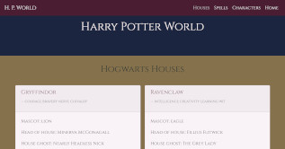

This project was bootstrapped with [Create React App](https://github.com/facebook/create-react-app).

# The Harry Potter App
> Hi everyone! This is my Harry Potter App. 

## Live
https://mateuszlubianka1993.github.io/harry-potter-app/

## Technologies:
* React
* Java Script
* HTML5
* CSS 3
* Bootstrap
* Redux
* Axios library
* Redux-thunk
* React-router-dom

## General info
This is Harry Potter App. You can enter to H.Potters world and find information abat books and movies.
I used https://hp-api.herokuapp.com/ and https://www.potterapi.com/.

## Screenshots

## Contact
Created by [lubiankamateusz@gmail.com] - feel free to contact me!